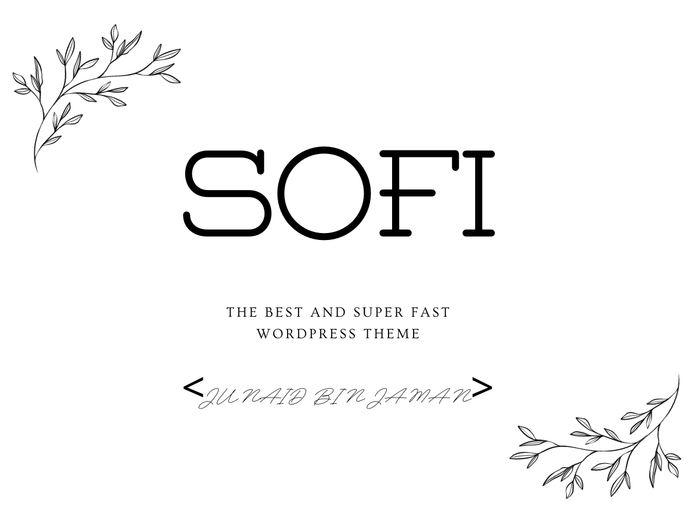

# Sofi a portfolio theme for Wordpress

Sofi is a free and open-source WordPress theme designed to build super light weight yet modern portfolio website within just 1 hour without any coding knowledge. It is released under the [GNU General Public License (GPL)](https://www.gnu.org/licenses/gpl-2.0.html), which means you can use, modify, and distribute it freely.

## Features

- Super light weight
- Beautiful design
- Page builder less (Do not require any page builder knowledge)
- Easy management option
- Heigh resulation and works with all major browsers
- 100% free to use

## Getting Started

### Prerequisites

- WordPress installed and configured.
- Do not need to have a basic understanding of WordPress themes and customization.

### Installation

1. [Download](https://github.com/junaidbinjaman/Sofi-WordPress-Theme) the Sofi theme from the GitHub repository.
2. Upload the theme to your WordPress website's themes directory (`wp-content/themes`).
3. Activate the Sofi theme in the WordPress admin panel.

### Configuration

This theme doesn't require any additional 

## Usage

On wordpress left hand side navigation, now you should see a new option called `Sofi options`
Click on it. Now you will get a very user guidance on how to change contents for each section
Just go through the tabs one by one and change the contents

## Contributing

We welcome contributions to improve the Sofi theme. To contribute, follow these steps:

1. Fork the [Sofi GitHub repository](https://github.com/junaidbinjaman/Sofi-WordPress-Theme).
2. Create a new branch for your feature or bugfix.
3. Make your changes and commit them with descriptive messages.
4. Push your changes to your fork.
5. Submit a pull request to the original Sofi repository.

## License

Sofi is released under the GNU General Public License (GPL-2.0 or later). See the [LICENSE](LICENSE) file for more details.

## Support

If you encounter any issues or have questions, please [open an issue](https://github.com/your-username/sofi-theme/issues) on GitHub.

## Changelog

- Sofi V1.0.0 Initial release of sofi theme with minimalistic feature
- Sofi V2.0.0 is in progress coming with with some major updates

## Author

- Name: [Junaid Bin Jaman]
- Email - [me@junaidbinjaman.com](mailto:me@junaidbinjaman.com)
- Website [https:junaidbinjaman.com](https:junaidbinjaman.com)
- Social media: [Instagram](https://www.instagram.com/junaidbinjaman/) [LinkedIN](https://www.linkedin.com/in/junaid-bin-jaman-5b75a7181/)

## Screenshot

